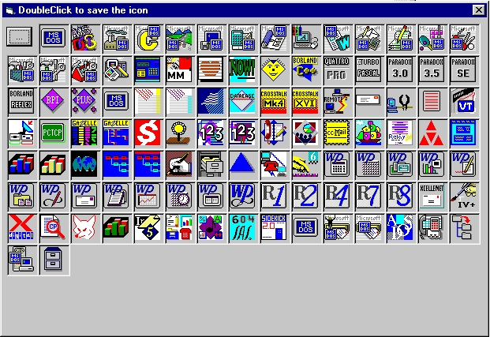



## Extract Icons

### Description

Extract and save Icons from dlls, ans exe files.

I used an example found on AllApi.net
 
### More Info
 

             |
---                |---
**Submitted On**   |2000-05-17 13:34:48
**By**             |[Puskai Zoltan](https://github.com/Planet-Source-Code/PSCIndex/blob/master/ByAuthor/puskai-zoltan.md)
**Level**          |Beginner
**User Rating**    |4.8 (38 globes from 8 users)
**Compatibility**  |VB 5\.0, VB 6\.0
**Category**       |[Miscellaneous](https://github.com/Planet-Source-Code/PSCIndex/blob/master/ByCategory/miscellaneous__1-1.md)
**World**          |[Visual Basic](https://github.com/Planet-Source-Code/PSCIndex/blob/master/ByWorld/visual-basic.md)
**Archive File**   |[CODE\_UPLOAD58595172000\.zip](https://github.com/Planet-Source-Code/puskai-zoltan-extract-icons__1-8151/archive/master.zip)

